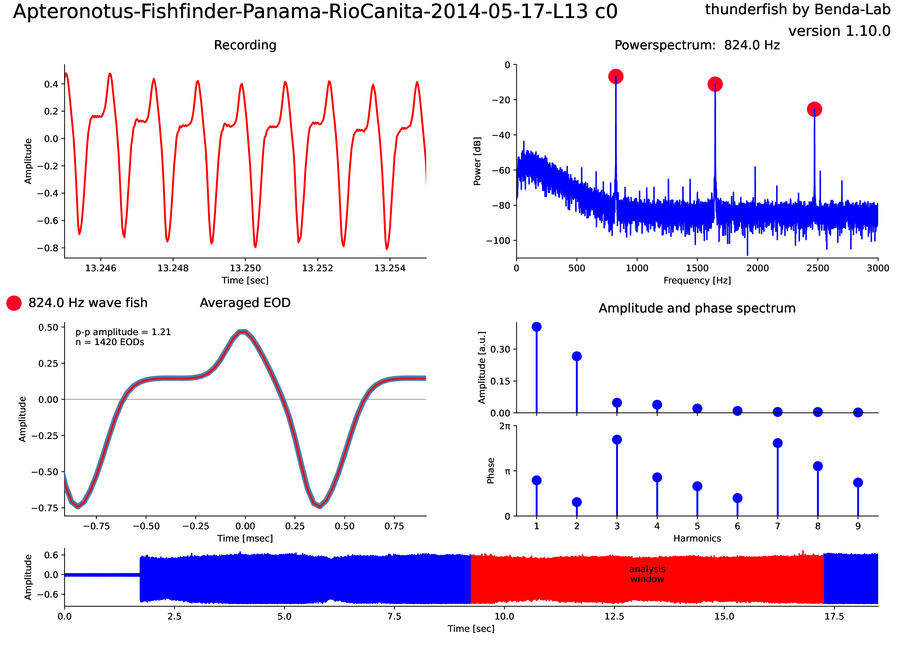

[](https://github.com/bendalab/thunderfish/blob/master/LICENSE)
[](https://github.com/bendalab/thunderfish/actions)
[](https://bendalab.github.io/thunderfish/cover)
[](https://pypi.python.org/pypi/thunderfish/)

[](https://github.com/bendalab/thunderfish/graphs/contributors)
[](https://github.com/bendalab/thunderfish/pulse)
<!--


-->

# ThunderFish

Algorithms and programs for analysing electric field recordings of
weakly electric fish.

[Documentation](https://bendalab.github.io/thunderfish/) |
[API Reference](https://bendalab.github.io/thunderfish/api/)

Weakly electric fish generate an electric organ discharge (EOD).  In
wave-type fish the EOD resembles a sinewave of a specific frequency
and with higher harmonics. In pulse-type fish EODs have a distinct
waveform and are separated in time. The thunderfish package provides
algorithms and tools for analysing both wavefish and pulsefish EODs.



## Installation

ThunderFish is available from
[PyPi](https://pypi.org/project/thunderfish/). Simply run:
```
pip install thunderfish
```

If you have problems loading specific audio files with thunderfish,
then you need to install further packages. Follow the [installation
instructions](https://bendalab.github.io/audioio/installation/) of the
[AudioIO](https://bendalab.github.io/audioio/) package.


## Software

The thunderfish package provides the following software:

- [`fishfinder`](https://bendalab.github.io/thunderfish/fishfinder/): Browse EOD recordings and detect EOD frequencyies on the fly.
- [`thunderfish`](https://bendalab.github.io/thunderfish/thunderfish/): Detect, analyze, and plot all EOD waveforms in short recordings.
- [`collectfish`](https://bendalab.github.io/thunderfish/collectfish/): Collect data generated by [`thunderfish`](https://bendalab.github.io/thunderfish/thunderfish/).
- [`eodexplorer`](https://bendalab.github.io/thunderfish/eodexplorer/): View and explore properties of EOD waveforms.
- [`thunderbrowse`](https://bendalab.github.io/thunderfish/api/thunderbrowse/): Browse multi-channel EOD recordings.
- [`thunderlogger`](https://bendalab.github.io/thunderfish/api/thunderlogger/): Extract EOD waveforms from logger recordings.
- [`convertdata`](https://bendalab.github.io/thunderfish/api/convertdata/): Convert data from various file formats to audio files.


## Algorithms

The following modules provide the algorithms for analyzing EOD recordings.
Look into the modules for more information.

### Input/output

- [`configfile`](https://bendalab.github.io/thunderfish/api/configfile.html): Configuration file with help texts for analysis parameter.
- [`consoleinput`](https://bendalab.github.io/thunderfish/api/consoleinput.html): User input from console.
- [`dataloader`](https://bendalab.github.io/thunderfish/api/dataloader.html): Load time-series data from files.
- [`datawriter`](https://bendalab.github.io/thunderfish/api/datawriter.html): Write time-series data to files.
- [`tabledata`](https://bendalab.github.io/thunderfish/api/tabledata.html): Read and write tables with a rich hierarchical header including units and formats.

### Basic data analysis

- [`eventdetection`](https://bendalab.github.io/thunderfish/api/eventdetection.html): Detect and hande peaks and troughs as well as threshold crossings in data arrays.
- [`powerspectrum`](https://bendalab.github.io/thunderfish/api/powerspectrum.html): Compute and plot powerspectra and spectrograms for a given minimum frequency resolution.
- [`voronoi`](https://bendalab.github.io/thunderfish/api/voronoi.html): Analyse Voronoi diagrams based on scipy.spatial.
- [`multivariateexplorer`](https://bendalab.github.io/thunderfish/api/multivariateexplorer.html): Simple GUI for viewing and exploring multivariate data.

### EOD analysis

- [`bestwindow`](https://bendalab.github.io/thunderfish/api/bestwindow.html): Select the region within a recording with the most stable signal of largest amplitude that is not clipped.
- [`checkpulse`](https://bendalab.github.io/thunderfish/api/checkpulse.html): Check whether a pulse-type or a wave-type weakly electric fish is present in a recording.
- [`consistentfishes`](https://bendalab.github.io/thunderfish/api/consistentfishes.html): Create a list of EOD frequencies with fishes present in all provided fish lists.
- [`eodanalysis`](https://bendalab.github.io/thunderfish/api/eodanalysis.html): Analyse EOD waveforms.
- [`harmonics`](https://bendalab.github.io/thunderfish/api/harmonics.html): Extract and analyze harmonic frequencies from power spectra.
- [`pulses`](https://bendalab.github.io/thunderfish/api/pulses.html): Extract and cluster EOD waverforms of pulse-type electric fish.

### EOD simulations

- [`fakefish`](https://bendalab.github.io/thunderfish/api/fakefish.html): Simulate EOD waveforms.
- [`efield`](https://bendalab.github.io/thunderfish/api/efield.html): Simulations of spatial electric fields.
- [`fishshapes`](https://bendalab.github.io/thunderfish/api/fishshapes.html): Manipulate and plot fish outlines.


