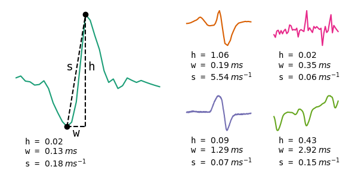

# Pulses
The purpose of the algorithm is to automatically detect and classify pulse-type EODs. A recording is scanned for pulse-type EODs, which are then clustered based on their waveforms. For each pulse-type weakly electric fish present in a recording, a sufficient amount of EOD timepoints is extracted to compute a reliable estimate of their original EOD.

## Raw data

The following figure shows some field recording snippets containing three pulse-type EODs, an artefact, and a wave-type EOD. It gives a quick overview on the variety in EOD waveforms, timescales and amplitudes. The pulses algorithm is designed to not only detect and classify pulse-type EODs, but also to discriminate between pulse and wave-type EODs, artefacts and noise.

## Principles

The pulse-fish EOD classification algorithm consists of three main steps:
1. Pulse-type EOD peak detection
2. EOD classification (clustering)
3. Post-processing

First of all, a peak detection algorithm is run that is specifically designed to detect multi-phasic EOD pulses in noisy environments. EOD pulses are detected even when they are superimposed on slower signals, such as wave-type EODs, 50/60Hz noise and/or static noise. 

Then, properties of all pulse EODs in a recording are extracted and clustered. As EOD shapes are species and location dependent, their features can be used to cluster the waveforms and infer the average waveform of each fish present in the recording.

Lastly, some post-processing steps are performed to make sure that each present pulse-type electric fish is only represented once, and to make sure that the extracted EOD timepoints are sufficient to estimate a reliable average EOD waveform.

### Peak detection
The peak detection algorithm consists of four steps: 

1. Detect all peaks and troughs
2. Create peak-trough pairs
3. Delete peak-trough pairs with unrealistic widths. (*w < 2/Fs or w> 30ms*)
4. Delete overlapping peak-trough pairs

Peaks and troughs are detected by an algorithm for identifying peaks in physiological signals (Bryan S. Todd and David C. Andrews (1999)). The threshold for this peak detection is determined by the median of the standard deviation of the recording data. The standard deviation is taken on 1000 windows of 0.5ms in size, uniformly distributed over the recording data. Choosing said window size enables the detection of pulse-type EODs peaks that are superimposed on wave-type waveforms of up to 2000Hz.

Peak-trough pairs are created by connecting each peak to a neighboring trough either on the right- or on the left-hand side of the peak. To determine which trough to connect to, for both peak-trough pair options, the amplitude difference and the amplitude difference divided by the temporal difference i.e. amplitude differential are computed. If the amplitude differential is similar for both sides (<=25%), the peak-trough pair which results in the highest amplitude difference is chosen. If the amplitude differential is too variable (>25%), the peak-trough pair which results in the highest amplitude differential is chosen. Said mechanism enables correct peak detection of narrow EODs that are superimposed on low frequency waves, even when these background waves are higher in amplitude.

Unrealistic peak-trough pair widths are either those that characterize noise and/or artefacts, e.g. widths that are close to the sampling frequency of the recording device, or those that are biologically not feasible due to their unrealistic temporal scale e.g. >30ms. As peak-trough pairs with said widths are likely not part of pulse-type EODs, they can be discarded.

Due to the nature of the peak-trough pair selection mechanism, it is possible that two peaks are connected to the same trough. As the clustering step is performed on features extracted based on both the peak and the trough of each peak-trough pair, overlap in these features is not desirable. Therefore, for all troughs that connect to two peaks, one of the peak-trough pairs is discarded. The mechanism for choosing the peak-trough pair that is to be kept is the same as the one used in step 2. 

Now that for each pulse-type EOD at least one peak-trough pair is made, the first features can be extracted. Extracted features are width, which is the temporal difference for each peak-trough pair, and height, which is the amplitude difference for each peak-trough pair.

### Clustering

The clustering algorithms is composed of five steps. First of all, a Gaussian clustering method is used to create clusters based on EOD width. Secondly, within each width cluster, another Gaussian clustering step is performed on EOD heights. Then, within these clusters, a third clustering step is performed on the principle components of the EOD waveforms centered on the peak and on the EOD waveforms centered on the trough. For this, the DBSCAN clustering algorithm is used. The fourth step of the clustering algorithm uses the mean features of each cluster to determine which clusters are pulse EODs and discards all wave-type EODs and artefacts. Lastly, the resulting clusters from peak-centered EOD waveforms are merged with the resulting clusters from trough-centered waveforms.

#### Width
EOD width is the only feature that remains stable for individual fish, even when they are moving with respect to the recording electrode, and is therefore assumed to be Gaussian distributed for individual fish. 
A <a href="https://scikit-learn.org/stable/modules/generated/sklearn.mixture.BayesianGaussianMixture.html" target="_blank">Bayesian Gaussian Mixture model (BGM)</a> is applied to all EOD widths, where a mixture of three Gaussians is fit to the distribution. BGM models are suitable when the number of clusters is unknown, as some of the Gaussian fit weights can be set to zero. Therefore, three is merely the maximum number of classes, where cases with less underlying EOD width distributions should result in less EOD width clusters. To prevent faulty EOD width clustering due to sparse data, an extra check is performed, where clusters with a median width similarity of over 50% are merged. 

##### Feature extraction
Not only is the EOD peak-trough width a useful feature for classifying EODs, it is also proportional to the entire EOD width, of which an estimate is desired to extract EOD waveforms. Therefore, after the first clustering step, EOD snippets are extracted around all EOD peaks and troughs for each width cluster, where the total snippet widths are proportional (3w&#771;) to the median peak-trough width of the EODs in that cluster.

In some recordings, EOD pulses are sparse and have a very good SNR. In this case, it is desirable to be strict in the following clustering steps, as in these conditions, it would be possible to separate EODs that are very similar in shape. If the signal to noise ratio (SNR) is low, e.g. due to low quality recording devices, pulsefish that are far away from the recording device, 60Hz noise, wavefish EODs and/or an abundance of electric fish in general, setting clustering thresholds that are too strict might result either in single pulsefish that are classified in multiple EOD clusters or in pulsefish that are not clustered at all. 
Therefore, a SNR is computed for each EOD snippet, by dividing the EOD height by the background activity amplitude. The background activity amplitude is here defined as the absolute amplitude difference between the first and the last instance of each EOD snippet.

#### Height

Now that all EOD snippets are extracted, one could cluster the EODs by their shape and height. However, automating cluster parameters at this point is tricky. As all EOD snippets contain multiple datapoints, the cluster space becomes multi-dimensional. Computing another BGM model in this space is possible and would be suitable as this method handles variable cluster densities well, due to the sigma fit that can be different for each Gaussian. To actually perform this clustering method on multi-dimensional data, on the other hand, a lot of computing time is needed as increasing dimensionality increases the search space for the model. The model could easily be stuck in local optima and would need to be run multiple times to obtain reliable results. Another drawback is for using a BGM for this clustering step is that it does not account for noise and will either create a new cluster for noisy snippets or, even worse, include noise within the actual pulse EOD clusters. 

Consequently, regarding EOD shape, a distance-based clustering method is desired. DBSCAN is such a clustering method, which also performs well in discarding noise. For the DBSCAN method, two parameters are needed, of which one is the minimum distance between two points in cluster space for them to be identified as neighboring points. As this parameter is fixed for all clusters, all clusters should have similar densities. When taking the absolute distance between EOD snippets however, EODs with higher amplitudes will have be more distant in cluster space than EODs with lower amplitudes. This results in varying cluster densities, which complicates automating DBSCAN clustering. One could solve this issue by normalizing all EOD snippets. This again causes two problems. First of all, low amplitude EODs will show lower SNR ratios. If these EODs are normalized, the noise within these snippets scales linearly with the snippet. Cluster densities will now be variable not due to amplitude differences but due to SNR differences. Secondly, and most importantly, the EOD height is completely ignored when clustering, even though this contains valuable information on the pulsefish position. These issues are solved by computing two further clustering steps: one on height, which is a one-dimentional feature on which a BGM can be computed, and one further step on EOD shape where DBSCAN is used.

The relation between distance to the recording electrode and recorded EOD amplitude is negative and non-linear. In an oversimplified way, the electric field over distance is proportional to 1/r3, where r signifies the distance to the electric source. For stationary fish, the recorded EOD amplitude should be stable and somewhat Gaussian. Because of the non-linear relation between distance and EOD amplitude, fish that are closer to the recording electrode will have a more variable EOD amplitudes than fish that are further away from the recording electrode. To account for this variance bias, clustering is done on the logarithm of the EOD amplitudes.

A BGM model is used to cluster on the logarithm of the EOD heights, where a mixture of ten Gaussians is fit to the distribution. Then, all EOD height clusters with a median height similarity of 10% are merged. If the inverse SNR is higher than 10%, the background noise could have influenced the EOD height distribution resulting in a higher EOD amplitude variance. To avoid splitting such clusters in half, additionally, all clusters with a median height similarity of 1/SNR are merged.

#### Shape
There are two sets of EOD snippets, one that is EOD peak centered and one that is EOD trough centered. Depending on the relative orientation between pulsefish and electrode, EOD pulse activity could be centered either around the most significant EOD peak or trough, or around the midpoint of the most significant EOD peak and trough. Either of the snippet sets could convey most information on the EOD shape and result in the most reliable EOD clusters, thus clustering is performed on both snippets sets. The resulting clusters are merged later on.

Clustering on EOD shape is done by using <a href="https://scikit-learn.org/stable/modules/generated/sklearn.cluster.DBSCAN.html" target="_blank">DBSCAN</a>. As explained earlier, uniform cluster densities are desired and therefore, some normalization step is required. After normalizing the EOD snippets, the first five principle components are computed and used as features for clustering. This dimensionality reduction results in an improved computing time, standardizes the DBSCAN input dimensionality, and makes sure that only the most important features of the EODs are considered for clustering. 

### Normalization and feature extraction

The first normalization step gets rid of any background activity. Then, the mean of the EOD is subtracted. Lastly, all EOD snippets are multiplied by a factor so that their absolute integral equals one. 

Then, PCA is done on all snippets, and the first five PCs are used for clustering.

#### DBSCAN

DBSCAN requires two parameters: epsilon and minp. 

-> DBSCAN

-> how do I choose features?

#### Selecting pulse-type EOD clusters

-> artefacts/noise
-> wavefish
-> sidepeaks

#### Merge clusters
    while clusters in A and B:
        select cluster C with largest N
        if C in A:
            delete clusters in B with at least one connection to C
            save cluster C and delete from A
        if C in B:
            delete clusters in A with at least one connection to C
            save cluster C and delete from B

### Post-processing
#### Moving fish

-> window size formula

#### Sparse clusters
*Nw < T&rho;min*

#### Note
All plots were generated by plotpulseexamples.py and are based on real data. To replicate, set -VVV and safe_plots==True in extract_pulses.