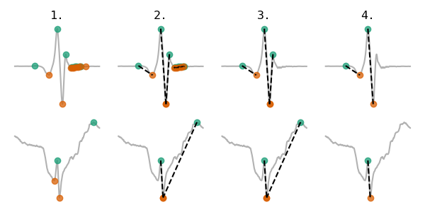
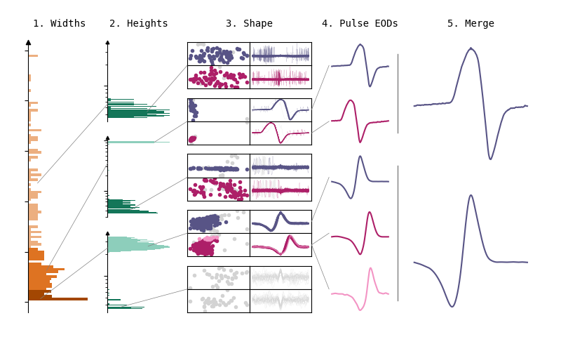
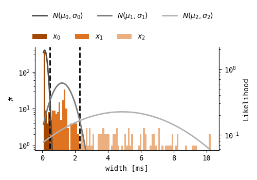
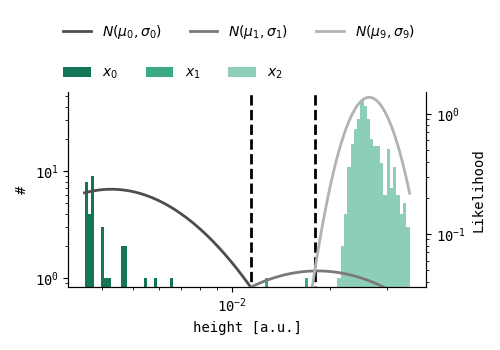
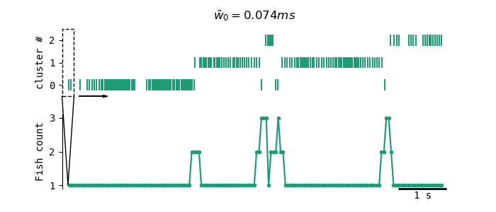

# Pulses
The purpose of the algorithm is to automatically detect and classify pulse-type EODs. A recording is scanned for pulse-type EODs, which are then clustered based on their waveforms. For each pulse-type weakly electric fish present in a recording, a sufficient amount of EOD timepoints is extracted to compute a reliable estimate of their original EOD.

### Raw data

The following figure shows some field recording snippets containing three pulse-type EODs, an artefact, and a wave-type EOD. It gives a quick overview on the variety in EOD waveforms, timescales and amplitudes. The pulses algorithm is designed to not only detect and classify pulse-type EODs, but also to discriminate between pulse and wave-type EODs, artefacts and noise.

## Principles

The pulse-fish EOD classification algorithm consists of four main steps:

1. Data preprocessing
2. Pulse-type EOD peak detection
3. EOD classification (clustering)
4. Post-processing

First of all, the analyzed recording data is interpolated to 500kHz. Secondly, a peak detection algorithm is run that is specifically designed to detect multi-phasic EOD pulses in noisy environments. EOD pulses are detected even when they are superimposed on slower signals, such as wave-type EODs, 50/60Hz noise and/or static noise. Then, properties of all pulse EODs in a recording are extracted and clustered. As EOD shapes are species and location dependent, their features can be used to cluster the waveforms and infer the average waveform of each fish present in the recording. Lastly, some post-processing steps are performed to ensure that each present pulse-type electric fish is only represented once, and to ensure that the extracted EOD timepoints are sufficient to estimate a reliable average EOD waveform.

### Data preprocessing
As the clustering methods depend on EOD waveform similarities, they should be of high enough resolution to properly align and compare waveforms. To ensure this, the recording data is quadratically interpolated to 500 kHz, which should be high enough to show smooth EOD pulses even for Mormyrids.

### Pulse-type EOD peak detection
The peak detection algorithm consists of four steps: 

1. Detect all peaks and troughs.
2. Create peak-trough pairs.
3. Delete peak-trough pairs with unrealistic widths (*w < 2/Fs or w> 30ms*).
4. Delete overlapping peak-trough pairs.

Peaks and troughs are detected by an algorithm for identifying peaks in physiological signals (Bryan S. Todd and David C. Andrews (1999)). The threshold for this peak detection is determined by the median of the standard deviation of the recording data. The standard deviation is taken on 1000 windows of 0.5ms in size, uniformly distributed over the recording data. Choosing said window size enables the detection of pulse-type EODs peaks that are superimposed on wave-type waveforms of up to 2000Hz.

Peak-trough pairs are created by connecting each peak to a neighboring trough either on the right- or on the left-hand side of the peak. To determine which trough to connect to, for both peak-trough pair options, the amplitude difference and the amplitude difference divided by the temporal difference i.e. amplitude differential are computed. If the amplitude differential is similar for both sides (<=25%), the peak-trough pair which results in the highest amplitude difference is chosen. If the amplitude differential is too variable (>25%), the peak-trough pair which results in the highest amplitude differential is chosen. Said mechanism enables correct peak detection of narrow EODs that are superimposed on low frequency waves, even when these background waves are higher in amplitude.

Unrealistic peak-trough pair widths are either those that characterize noise and/or artefacts, e.g. widths that are close to the sampling frequency of the recording device, or those that are biologically not feasible due to their unrealistic temporal scale e.g. >30ms. As peak-trough pairs with said widths are likely not part of pulse-type EODs, they are discarded.

Due to the nature of the peak-trough pair selection mechanism, it is possible that two peaks are connected to the same trough. As the clustering step is performed on features extracted based on both the peak and the trough of each peak-trough pair, overlap in these features is not desirable. Therefore, for all troughs that connect to two peaks, one of the peak-trough pairs is discarded. The mechanism for choosing the peak-trough pair that is to be kept is the same as the one used in step 2. 

Now that for each pulse-type EOD at least one peak-trough pair is made, the first features can be extracted. Extracted features are width, which is the temporal difference for each peak-trough pair, and height, which is the amplitude difference for each peak-trough pair.

### EOD classification (clustering)

The clustering algorithm is composed of five steps. First of all, a Gaussian clustering method is used to create clusters based on EOD width. Secondly, within each width cluster, another Gaussian clustering step is performed on EOD heights. Then, within these clusters, a third clustering step is performed on the principle components of the EOD waveforms centered on the peak and on the EOD waveforms centered on the trough. For this, the DBSCAN clustering algorithm is used. The fourth step of the clustering algorithm uses the mean features of each cluster to determine which clusters are pulse EODs, and discards all wave-type EODs and artefacts. Lastly, the resulting clusters from peak-centered EOD waveforms are merged with the resulting clusters from trough-centered waveforms.

#### Width
EOD width is the only feature that remains stable for individual fish, even when they are moving with respect to the recording electrode, and is therefore assumed to be Gaussian distributed for individual fish. 
A <a href="https://scikit-learn.org/stable/modules/generated/sklearn.mixture.BayesianGaussianMixture.html" target="_blank">Bayesian Gaussian Mixture model (BGM)</a> is applied to all EOD widths, where a mixture of three Gaussians is fit to the distribution. BGM models are suitable when the number of clusters is unknown, as some of the Gaussian fit weights can be set to zero. Therefore, three is merely the maximum number of clusters, where cases with less underlying EOD width distributions should result in less EOD width clusters. A maximum of three width clusters is expected, as EOD width is species dependent, and even though more than three pulsetype fish could be present in one recording, the maximum number of pulse-type fish species found in one wild recording is expected not to exceed three. To prevent faulty EOD width clustering due to sparse data, an extra check is performed, where clusters with a median width similarity of over 50% are merged. 

##### Feature extraction
Not only is the EOD peak-trough width a useful feature for classifying EODs, it is also proportional to the entire EOD width, of which an estimate is desired to extract EOD waveforms. Therefore, after the first clustering step, EOD snippets are extracted around all EOD peaks and troughs for each width cluster, where the total snippet widths are proportional to the median peak-trough width of the EODs in that cluster (3w&#771;).

In some recordings, EOD pulses are sparse and have a very good Signal to Noise Ratio (`SNR`). In this case, it is desirable to be strict in the following clustering steps, as in these conditions, it would be possible to separate EODs that are very similar in shape. If the `SNR` is low, e.g. due to low quality recording devices, pulsefish that are far away from the recording device, 60Hz noise, wavefish EODs and/or an abundance of electric fish in general, setting clustering thresholds that are too strict might result either in single pulsefish that are classified in multiple EOD clusters or in pulsefish that are not clustered at all. 
Therefore, `SNR` is computed for each EOD snippet, by dividing the EOD height by the background activity amplitude. The background activity amplitude is here defined as the absolute amplitude difference between the first and the last instance of each EOD snippet.

#### Height

Now that all EOD snippets are extracted, one could cluster the EODs by their shape and height. However, automating cluster parameters at this point is tricky. As all EOD snippets contain multiple datapoints, the cluster space becomes multi-dimensional. Computing another BGM model in this space is possible and would be suitable as this method handles variable cluster densities well, due to the sigma fit that can be different for each Gaussian. To actually perform this clustering method on multi-dimensional data, on the other hand, a lot of computing time is needed as increasing dimensionality increases the search space for the model. The model could easily be stuck in local optima and would need to be run multiple times to obtain reliable results. Another drawback of using a BGM for this clustering step is that it does not account for noise and will either create a new cluster for noisy snippets or, even worse, include noise within the actual pulse EOD clusters. 

Consequently, regarding EOD shape, a distance-based clustering method is desired. DBSCAN is such a clustering method, which also performs well in discarding noise. For the DBSCAN method, two parameters are needed, of which one is the minimum distance between two points in cluster space for them to be identified as neighboring points. As this parameter is fixed for all clusters, all clusters should have similar densities. When taking the absolute distance between EOD snippets however, EODs with higher amplitudes will have be more distant in cluster space than EODs with lower amplitudes. This results in varying cluster densities, which complicates automating DBSCAN clustering. One could solve this issue by normalizing all EOD snippets. This again causes two problems. First of all, low amplitude EODs will show lower `SNR`s. If these EODs are normalized, the noise within these snippets scales linearly with the snippet. Cluster densities will now be variable not due to amplitude differences but due to `SNR` differences. Secondly, and most importantly, the EOD height is completely ignored when clustering, even though this contains valuable information on the pulsefish position. These issues are solved by computing two cascading clustering steps: one clustering step on height, which is a one-dimentional feature on which a BGM can be computed, and one further clustering step on EOD shape where DBSCAN is used.

The relation between electrical source distance to the recording electrode and recorded EOD amplitude is negative and non-linear. In an oversimplified way, the electric field over distance is proportional to 1/r3, where r signifies the distance to the electric source. For stationary fish, the recorded EOD amplitude should be stable and somewhat Gaussian. Because of the non-linear relation between distance and EOD amplitude, fish that are closer to the recording electrode will have more variable EOD amplitudes than fish that are further away from the recording electrode. To account for this variance bias, clustering is done on the logarithm of the EOD amplitudes.

A BGM model is used to cluster on the logarithm of the EOD heights, where a mixture of ten Gaussians is fit to the distribution. Then, all EOD height clusters with a median height similarity of 10% are merged. If `1/SNR` is higher than 10%, the background noise could have influenced the EOD height distribution resulting in a higher EOD amplitude variance. To avoid splitting such clusters in half, additionally, all clusters with a median height similarity of `1/SNR` are merged.

#### Shape
There are two sets of EOD snippets, one that is EOD peak centered and one that is EOD trough centered. Depending on the relative orientation between pulsefish and electrode, EOD pulse activity could be centered either around the most significant EOD peak or trough, or around the midpoint of the most significant EOD peak and trough. Either of the snippet sets could convey most information on the EOD shape and result in the most reliable EOD clusters, thus clustering is performed on both snippets sets. The resulting clusters are merged later on.

Clustering on EOD shape is done by using <a href="https://scikit-learn.org/stable/modules/generated/sklearn.cluster.DBSCAN.html" target="_blank">DBSCAN</a>. As explained earlier, uniform cluster densities are desired and therefore, some normalization step is required. After normalizing the EOD snippets, the first five principle components are computed and used as features for clustering. This dimensionality reduction results in an improved computing time, standardizes the DBSCAN input dimensionality, and makes sure that only the most important features of the EODs are considered for clustering. 

##### Normalization and feature extraction

The first normalization step gets rid of any background activity. If the EOD is superimposed on any type of slower waveform, this background activity can be approximated by a straight line. For each EOD snippet, a linear interpolation is made between the first and the last snippet instance and subtracted from the snippet. Secondly, any DC component is deleted, by subtracting the mean of the EOD. Lastly, all EOD snippets are multiplied by a factor so that their absolute integral equals one. This last step is useful as sets of EOD snippets can have different widths. Wider EOD snippets naturally have a higher distance in cluster space due to the increase in datapoints. The absolute integral is thus secured to standardize the cluster densities and therefore clustering parameters.

Lastly, PCA is done on all snippets, and the first five PCs are used for clustering.

##### DBSCAN parameters

DBSCAN is a nearest-neighbor based clustering method that requires two parameters: `epsilon` and `minp`. `minp` is the minimum amount of points that is needed to form a cluster, and `epsilon` is a value that determines the maximum distance between two points for them to be neighbors.
Both parameters are automatically set based on the data properties. `minp` is set to be equal to 1% of the total number of datapoints in cluster space. If this number is less than 10, `minp` is set to 10, as with the current `thunderfish` settings, the length of the analysis window is 8 seconds. As all pulse-type electric fish species generally have EOD rates above 2 Hz, a minimum cluster size of 10 is deemed sufficient. `epsilon` is set based on the 80th percentile of the K-Nearest Neighbor distribution, where K is `minp`. This measure ensures that 80% of the datapoints in cluster space are connected to at least `minp` datapoints. With said method, clusters would be formed even for datapoints with great dissimilarities. To prevent `epsilon` from growing too large, an upper bound is set. Generally, the maximum value for `epsilon` (`eps_max`) would only allow for a certain variance within clusters. As all EOD snippets have their absolute integral set to 1, setting `eps_max` to 0.1 would result in EOD clusters with a maximum variance of 10%. However, for EODs with a low `SNR`, more EOD variance is expected. Therefore, if `1/SNR` is over 0.25, `eps_max = 0.4/SNR`.

#### Selecting pulse-type EOD clusters
Now that all clusters are formed, all clusters that are composed of artefacts, noise, wavefish and/or wrongly centered pulse-type EODs should be deleted. To separate the desired pulse-type EOD clusters from the undesirable clusters, three measures are used.
The first measure is based on the discrete Fast Fourier Transform (FFT) of the normalized average cluster waveform. Artefacts and noise are expected to have more activity in high frequency ranges, and EOD waveforms are expected to have more activity in low frequency ranges. As the FFT is limited by the Nyquist frequency (`f_Nyq`) of the recording data, and as the sampling rate is often chosen so that pulse-type EODs are slower than the Nyquist frequency, the measure that is used for determining the ratio of low frequency activity in an EOD snippet is the integral of the entire FFT divided by the integral of the mean EOD FFT up to `f_Nyq/2`. All EOD clusters with low frequency ratios below 75% are discarded.

The second measure is based on the ratio between EOD peak to trough widths and the distances between two consecutive EODs (ISI). Pulse-type electric fish are characterized by their relatively narrow pulses and broad ISIs while wave-type fish have pulses and ISIs that are in the same order of magnitude. Therefore, any clusters that have at least one EOD peak-trough width to ISI ratio above 0.5 are discarded.

The last measure is based on the peaks and troughs found in a zoomed out version (snippet width = 8w&#771;) of the average cluster EOD, where the peaks and troughs are computed by the method of Bryan S. Todd and David C. Andrews (1999) and the threshold is set to the standard deviation of the snippet. First of all, it can be determined whether the EOD cluster is based on a wrongly centered EOD pulse, as the maximum peak-trough distance of the average cluster EOD should be centered. If this is not the case, the cluster can be deleted. Furthermore, it can be the case that an EOD cluster is composed of wavefish snippets, but was not discarded earlier, as the EODs are only sparsely detected, and therefore result in low EOD peak-trough width to ISI ratios. To account for such cases, EOD clusters are discarded if the number of peaks and troughs detected in the average zoomed out EOD exceeds four. An extra check is performed on this zoomed out average EOD by computing the difference between the width of the most significant peak-trough in the average EOD and in the original EODs. If this difference is over 50%, it indicates that even if there are some pulse-type EODs in this cluster, they are not preserved in the mean EOD and are therefore discarded.

#### Merge clusters
As clustering was done on peak-centered snippets and on trough-centered EOD snippets, most pulse-type EOD clusters are represented at least twice. In some cases, the snippets that are centered either on the EOD peaks or EOD troughs are slightly misaligned, resulting in the formation of two clusters for one fish. This misalignment only happens on EOD peaks or troughs that are not in the center of the EOD pulse, as this is a more variable area than the EOD center. Due to centering the snippets on the most significant EOD peak and through, either one of the snippets should be best aligned and result in the best EOD clustering. Merging clusters is therefore done in several steps, where in each step, the largest cluster is saved. 

Below is some pseudo-code that describes the cluster merging algorithm. Here, `A` is the set of clusters for the peak-centered EODs and `B` is the set of clusters for the trough-centered EODs. As all detected peaks and troughs are present in pairs, each datapoint in `A` has one mapping to a datapoint in `B`. 

    while clusters in A and B:
        select cluster C with largest N
        if C in A:
            delete clusters in B with at least one connection to C
            save cluster C and delete from A
        if C in B:
            delete clusters in A with at least one connection to C
            save cluster C and delete from B

### Post-processing
Lastly, two post-processing steps are performed to account for moving fish and sparse EOD clusters.

#### Moving fish
Due to their dipole electric fields, electric fish that move with respect to the recording electrode display varying EOD shapes and amplitudes, which in turn leads to a single fish that is represented in multiple EOD clusters. The only factor that remains stable for moving pulsefish is their EOD pulsewidth.
To ensure that each fish is only represented once, the following method is used.

As EOD widths are not changing for moving fish, EODs in different width clusters are treated separately, as they cannot possibly come from the same fish. To estimate the actual number of fish in a recording for each width cluster, a sliding window is used. The sliding window is slid over all timepoints in the recording and counts the number of EOD clusters in a width cluster. The minimum number of EOD clusters that are counted within any of these windows should give a lower bound on the actual number of fish present in a recording.  
The stepsize of the sliding window is 0.1s. The width of this sliding window is either 0.25s, or, if the mean EOD peak-trough width is larger than 0.125ms, a factor of the mean EOD peak-trough width (2000w&#771;) of the width cluster. Sliding window size is adaptive to EOD width as pulsefish with longer EOD pulses typically also have lower EOD rates. With lower EOD rates, sliding window sizes should grow so that at least one EOD pulse is present in each window.

To account for gaps in the recordings due to malfunctioning of the recording devices, for all timepoints where zero EOD clusters are present, surrounding fishcounts (those that are within one sliding window size of these timepoints) are also set to zero and ignored for further analysis. This is done so that only sliding windows with sufficient data are used for fish count estimates.

Lastly, one window is selected where at least one EOD cluster is present, the least number of clusters are counted, and the amplitudes of the mean cluster EODs are largest. All EOD clusters that are not present in this selected window are then deleted.

#### Sparse clusters
As a final check on EOD cluster quality, EOD clusters that make up less than a certain percentage of the analyzed recording window are deleted. For this the following formula is used: *Nw < T&rho;min*. Here, *N* is EOD cluster size, *w* is EOD peak-trough width, *T* is the length of the analysis window and *&rho;min* is the minimum EOD density that quantifies a reliable EOD cluster. Here, *&rho;min* is set to 0.05%.

### Note
All plots were generated by `docs/pulseplots.py` and are based on real data. To reproduce results, see `docs/pulsedata.py`.